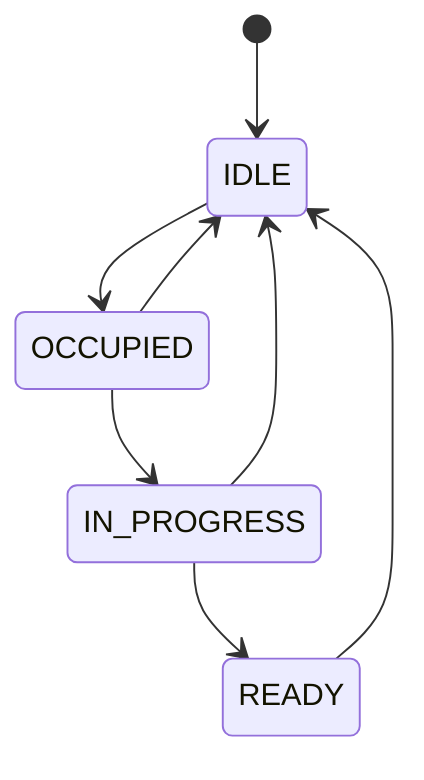
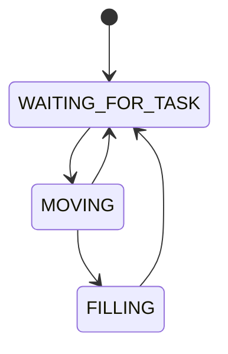
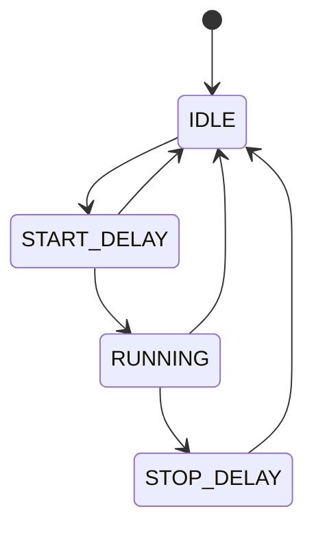

# RoboBarman
This project is for the computer systems architecture course. Its objective is to create a computer system designed to detect cups placed in specific locations and fill them with liquid. The compiled code will run on an ATmega328P microcontroller. The prototype board for development is Arduino Uno.


## Getting started

0. Prerequisites:
- VS Code with installed extension [PlatformIO IDE](https://docs.platformio.org/en/latest/integration/ide/pioide.html).
- Arduino Uno board (ATmega328P).

1. Clone repo and open with VS Code. PlatformIO automatically downloads all dependencies.
```bash
git clone https://github.com/Aleks334/RoboBarman.git
```

2. Compile project:
```bash
pio run -e uno
```

3. Upload project to the board:
```bash
pio run -t upload
```

More about [PlatformIO CLI](https://docs.platformio.org/en/latest/core/index.html)

> [!NOTE]
> Please make sure that your board is detected by PlatformIO by running: `pio device list`.

## Testing

To run unit tests located in `test/` directory use this command:
```bash
pio test -e uno
```

## Configuration

To adjust the behaviour or change pins please edit `GlobalConfig.h` file [here](/include/GlobalConfig.h).

## Project documentation

### Setup
-	The arm returns to position 0
-	The pump is off
-	The order queue is empty
-	currently_served = NULL
-	stations array length = NUMBER_OF_STATIONS - 1. All stations default to IDLE state.
-	LEDs are SOLID_GREEN


### States and transitions 

#### Station

States:
- IDLE – Station is empty.
- OCCUPIED – Cup detected, waiting in queue.
- IN_PROGRESS – System has started handling the order.
- READY – Liquid dispensed, cup ready for pickup.

Transitions:


#### Barman

States:
-	WAITING_FOR_TASK
-	MOVING
-	FILLING

Transitions:


#### Pump

States:
- IDLE
- START_DELAY
- RUNNING
- STOP_DELAY

Transitions:


### Happy path
1. User places a cup on one of the available stations.
2. The sensor detects the cup; station state changes to OCCUPIED, LED turns SOLID_RED.
3. The system pulls the task from the queue. Station state changes to IN_PROGRESS, LED FLASHING_RED.
4. The robot moves the arm to the station's position.
5. The robot initiates the pouring sequence.
6. Station state changes to READY, LED FLASHING_GREEN.
7. User removes the cup, releasing station. Station state returns to IDLE, LED turns SOLID_GREEN.

### Edge cases to manage
1. Cup removed during the filling process.<br>
    **[SOLVED]:** barman calls abort() method to instantly return to idle position, turn off the pump and cancel order.

2. Liquid tank is empty.<br>
    **[IN PROGRESS]**

3. Microcontroller reset during the filling process.<br>
    **[IN PROGRESS]**

4. Hand placed instead of a cup.<br>
     **[SOLVED]:** sensors are located from bottom of the case and only placing cup inside the station hole will trigger the process.
