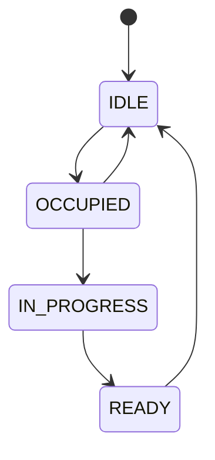
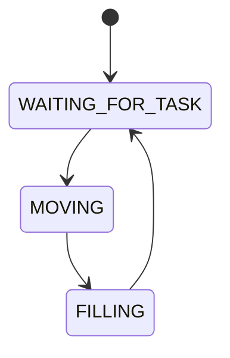

# RoboBarman
This project is for the computer systems architecture course. Its objective is to create a computer system designed to detect cups placed in specific locations and fill them with liquid. The compiled code will run on an ATmega328P microcontroller. The prototype board for development is Arduino Uno.


## Getting started

0. Prerequisites:
- VS Code with installed extension [PlatformIO IDE](https://docs.platformio.org/en/latest/integration/ide/pioide.html).
- Arduino Uno board (ATmega328P).

1. Clone repo and open with VS Code. PlatformIO automatically downloads all dependencies.
```bash
git clone https://github.com/Aleks334/RoboBarman.git
```

2. Compile project:
```bash
pio run -e uno
```

3. Upload project to the board:
```bash
pio run -t upload
```

More about [PlatformIO CLI](https://docs.platformio.org/en/latest/core/index.html)

> [!NOTE]
> Please make sure that your board is detected by PlatformIO by running: `pio device list`.

## Testing

To run unit tests located in `test/` directory use this command:
```bash
pio test -e uno
```

## Project documentation

### Setup
-	The arm returns to position 0
-	The pump is off
-	The order queue is empty
-	currently_served = NULL
-	stations array length = NUMBER_OF_STATIONS - 1. All stations default to IDLE state.
-	LEDs are SOLID_GREEN


### States 

Station states:
- IDLE – Station is empty.
- OCCUPIED – Cup detected, waiting in queue.
- IN_PROGRESS – System has started handling the order.
- READY – Liquid dispensed, cup ready for pickup.

Transitions:


Bartender States:
-	WAITING_FOR_TASK
-	MOVING
-	FILLING

Transitions:


### Happy path
1. User A places a cup on one of the available stations.
2. The sensor detects the cup; station state changes to OCCUPIED, LED turns SOLID_RED.
3. The system pulls the task from the queue. Station state changes to IN_PROGRESS, LED FLASHING_RED.
4. The robot moves the arm to the station's position.
5. The robot turns the pump ON.
6. After the specified duration, the pump turns OFF.
7. Station state changes to READY, LED FLASHING_GREEN.
8. User A removes the cup, releasing station. Station state returns to IDLE, LED turns SOLID_GREEN.


### Main loop pseudocode
```
// Sensor handling.
For each station (i) in the stations array:
    If sensors[i] DETECTS cup AND stations[i] == IDLE:
        stations[i] = OCCUPIED
        led[i] = SOLID_RED
        Add (i) to the end of the queue
        
    If sensors[i] DOES NOT DETECT cup AND (stations[i] == OCCUPIED OR stations[i] == READY):
        stations[i] = IDLE
        led[i] = SOLID_GREEN


// Queue and dispensing handling.
If BARTENDER_STATE == WAITING_FOR_TASK AND queue_length > 0:
    currently_served = Pull and remove the first element from the queue
    If stations[currently_served] == OCCUPIED:
        stations[currently_served] = IN_PROGRESS
        led[currently_served] = FLASHING_RED
        Move arm to position(currently_served)
        Save current time to: movement_start_time
        BARTENDER_STATE = MOVING

If BARTENDER_STATE == MOVING:
    If (current_time - movement_start_time) >= ARM_MOVEMENT_DURATION:
        Turn pump ON
        Save current time to: pump_start_time
        BARTENDER_STATE = FILLING

If BARTENDER_STATE == FILLING:
   If (current_time - pump_start_time) >= FILLING_DURATION:
        Turn pump OFF
        stations[currently_served] = READY
        led[currently_served] = FLASHING_GREEN
        BARTENDER_STATE = WAITING_FOR_TASK
        currently_served = NULL
```

### Edge cases to manage
- Cup removed during the filling process.
- Liquid tank is empty
- Microcontroller reset during the filling process.
- Hand placed instead of a cup